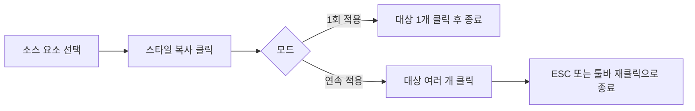

# LandPress Studio — 스타일 복사(Style Copy) 기능 제안

| 항목 | 내용 |
|------|------|
| **문서 유형** | 서비스 주간회의 발표 자료 (초안) |
| **담당** | [본인 이름] |
| **관련 티켓** | [LDPS-17675](https://jira.workers-hub.com/browse/LDPS-17675) |
| **작성일** | 2026-06-06 |
| **상태** | 초안 — 팀 논의용 |

---

## 1. 한 줄 요약

> **LandPress Studio 사이트 제작·편집 중, "이 요소 스타일을 저 요소에도 그대로 적용하고 싶다"는 니즈에 대응하는 스타일 복사(서식 복사) 기능을 LPS에 도입하자.**

---

## 2. 배경 — 왜 지금 이야기하는가

LandPress Studio에서 사이트를 제작·편집할 때, 아래와 같은 불편이 반복적으로 관찰됩니다.

- 비슷한 버튼·텍스트·카드가 여러 곳에 있는데, **각각 Inspector에서 동일한 값을 수동으로 맞춰야 함**
- 템플릿을 커스터마이징할 때 **한 요소에서 잘 맞춘 스타일을 다른 요소에 재사용하기 어려움**
- Wix, Design Studio, Excel 등 **익숙한 도구에는 이미 있는 패턴**인데, LPS에는 없어 학습·작업 비용이 큼

현재 LPS 편집기는 좌측 Styles 패널(사이트 테마)과 우측 Inspector(요소별 Layout / Typography / Colors)로 스타일을 조정합니다. 요소 단위 스타일을 **복사 → 붙여넣기**하는 흐름은 아직 없습니다.

---

## 3. 제안 기능 정의

### 3.1 스타일 복사(Style Copy)란?

**소스 요소의 시각적 스타일을 읽어, 대상 요소에 일괄 적용하는 기능**입니다.

엑셀의 **서식 복사(Format Painter)**, Wix·Design Studio의 **Copy Style**과 유사한 UX를 목표로 합니다.

```
[소스 선택] → [스타일 복사 활성화] → [대상 클릭] → [스타일 적용]
```

### 3.2 복사 대상으로 기대하는 속성 (1차 범위 제안)

| 카테고리 | 포함 속성 (예시) |
|----------|------------------|
| **Typography** | Font family, size, weight, line-height, letter-spacing, text align, color |
| **Colors** | Text color, background, border color |
| **Layout** | Padding, margin, width(고정값인 경우) |
| **Border / Radius** | Border width/style, corner radius |
| **Button 스타일** | Corner style (None / Round / Pill), variant 등 |

> **제외 검토 항목**: 데이터 바인딩, 고유 ID, 콘텐츠(텍스트/이미지 URL), 반복(Collection) 구조 자체

### 3.3 참고 서비스 UX 패턴

| 서비스 | 기능명 | 핵심 UX |
|--------|--------|---------|
| **Microsoft Excel** | 서식 복사 | 한 번 클릭 = 1회 적용, 더블클릭 = 연속 적용 모드 |
| **Wix** | Copy Style | 요소 선택 후 스타일 복사 → 다른 요소 클릭 시 적용 |
| **Design Studio** | Style Copy | 디자인 툴 표준 패턴 — 브러시 아이콘, 커서 변경, 적용 후 해제 |

LPS에도 **업계 표준 패턴을 따르면** 별도 학습 없이 사용할 수 있습니다.

---

## 4. 사용자 시나리오

### 시나리오 A — 랜딩 페이지 CTA 버튼 통일

1. Hero 섹션 CTA 버튼 스타일을 맞춤 (색상, radius, padding)
2. 하단 섹션 CTA 3개에 동일 스타일을 적용해야 함
3. **스타일 복사**로 Hero 버튼 → 하단 버튼들에 순차 적용
4. Inspector를 3번 열어 값을 맞출 필요 없음

### 시나리오 B — 카드 컴포넌트 스타일 맞추기

1. Collection list의 첫 번째 카드 타이포·배경을 조정
2. 나머지 카드에도 동일 스타일 적용
3. 반복 리스트 내 **개별 아이템 스타일 동기화**에 활용

### 시나리오 C — 템플릿 커스터마이징 가속

1. Master Template에서 Heading 스타일을 브랜드에 맞게 수정
2. 페이지 내 다른 Heading들에 일괄 적용
3. **디자인 일관성 확보 시간 단축**

---

## 5. 기대 효과

| 관점 | 기대 효과 |
|------|-----------|
| **사용자 경험** | 반복 작업 감소, "익숙한 도구와 비슷한" 편집 경험 |
| **생산성** | 동일 스타일 요소가 많은 페이지에서 작업 시간 단축 |
| **디자인 품질** | 수동 입력 오차 감소 → 페이지 내 시각적 일관성 향상 |
| **서비스 경쟁력** | WYSIWYG 편집기 기본 기능 갭 해소 |
| **내부 운영** | 템플릿·캠페인 페이지 제작 시 운영팀/디자이너 협업 효율 개선 |

---

## 6. 제안 UX (초안)

### 6.1 진입점

| 위치 | 설명 |
|------|------|
| **캔버스 툴바** | 스타일 복사 아이콘 버튼 (브러시/페인트 롤러) |
| **요소 컨텍스트 메뉴** | "스타일 복사" / "스타일 붙여넣기" |
| **키보드 단축키** | `⌘/Ctrl + Shift + C` (복사), `⌘/Ctrl + Shift + V` (붙여넣기) — 추후 합의 |

### 6.2 동작 흐름



### 6.3 상태 표시

- 스타일 복사 모드 활성 시: **커서 변경** + 툴바 버튼 **active 상태**
- 적용 불가 요소 클릭 시: 토스트로 사유 안내 (예: "이 요소 유형에는 해당 스타일을 적용할 수 없습니다")
- Undo/Redo 지원 필수

---

## 7. 기술·제품 고려사항

### 7.1 적용 범위 정책 (논의 필요)

| 정책 | 옵션 A (보수적) | 옵션 B (적극적) |
|------|----------------|----------------|
| **요소 타입** | 동일 타입만 (Button → Button) | 호환 가능한 타입 간 허용 (Text → Heading 일부 속성) |
| **적용 단위** | 요소 단위만 | 요소 + 하위 자식 일괄 적용 옵션 |
| **사이트 테마** | 요소 로컬 스타일만 | Site Styles(좌측 패널)와의 관계 명확화 필요 |

**1차(MVP) 권장**: 옵션 A — 동일/유사 컴포넌트 타입 간, Inspector에서 편집 가능한 속성만 복사

### 7.2 LPS 아키텍처와의 관계

현재 편집기 구조 기준:

- **좌측 Styles 패널**: 사이트 전역 테마 (Main / Text / Background, Button corners)
- **우측 Inspector**: 선택 요소의 Layout / Typography / Colors

스타일 복사는 **우측 Inspector 수준의 요소별 스타일**을 다루는 기능으로 정의하는 것이 자연스럽습니다. 전역 테마와 충돌하지 않도록 "로컬 오버라이드" vs "테마 토큰 참조" 구분이 필요합니다.

### 7.3 제약·예외 처리

- Collection 반복 아이템: 첫 아이템 스타일 → 전체 아이템 적용 여부
- 반응형(Desktop / Tablet / Mobile): 디바이스별 스타일 복사 범위
- AI 생성 결과물 편집 시: 생성 직후 스타일 정리 워크플로우와의 연계 (Q3 목표와 시너지)

---

## 8. 범위 제안 (단계별)

### Phase 1 — MVP (제안 시작점)

- [ ] 단일 소스 → 단일 대상, 1회 적용
- [ ] Typography + Colors + Border/Radius
- [ ] 동일 컴포넌트 타입 간 적용
- [ ] Undo 지원
- [ ] 캔버스 툴바 진입점

### Phase 2 — 사용성 강화

- [ ] 연속 적용 모드 (Excel/Wix 패턴)
- [ ] 키보드 단축키
- [ ] "스타일 붙여넣기" (클립보드에 스타일 임시 보관)
- [ ] 적용 전 미리보기 또는 적용 속성 목록 표시

### Phase 3 — 확장

- [ ] 유사 타입 간 부분 적용 (예: Paragraph → Heading, 공통 타이포만)
- [ ] Collection 아이템 일괄 적용
- [ ] 디바이스별 스타일 복사 정책

---

## 9. 성공 지표 (제안)

| 지표 | 측정 방법 |
|------|-----------|
| 기능 사용률 | 스타일 복사 실행 횟수 / 편집 세션 수 |
| 작업 시간 | 동일 스타일 3개 이상 요소 페이지 — Before/After 작업 시간 (유저 리서치) |
| 품질 | 스타일 불일치로 인한 QA 이슈 건수 변화 |
| 만족도 | 편집기 사용성 설문 / 인터뷰 피드백 |

---

## 10. 리스크 및 오픈 이슈

| # | 이슈 | 논의 포인트 |
|---|------|-------------|
| 1 | 요소 타입별 적용 가능 속성 정의 | PM + Design + Eng 공동 스펙 필요 |
| 2 | 전역 테마 vs 로컬 스타일 우선순위 | 복사 시 어떤 레이어를 덮어쓰는지 |
| 3 | 반응형 스타일 | 현재 디바이스 기준만 복사할지, 전 디바이스 동시 적용할지 |
| 4 | 개발 우선순위 | Q3 Studio UX 일관성 기준 정립과의 우선순위 조율 |
| 5 | 접근성 | 키보드-only 사용자를 위한 모드 진입·종료·피드백 |

---

## 11. 다음 단계 (Action Items)

| 순서 | 액션 | 담당 | 목표 시점 |
|------|------|------|-----------|
| 1 | 주간회의에서 방향성 공유 및 피드백 수집 | [본인] | 이번 주 |
| 2 | [LDPS-17675](https://jira.workers-hub.com/browse/LDPS-17675) 티켓에 요구사항·범위 정리 | [본인] | TBD |
| 3 | Wix / Excel / 경쟁 편집기 UX 레퍼런스 캡처·정리 | [본인] | TBD |
| 4 | PM·개발·디자인 3자 스펙 킥오프 | TBD | TBD |
| 5 | MVP 와이어프레임 (툴바 + 모드 상태 + 예외 토스트) | TBD | TBD |
| 6 | Phase 1 개발 일정·리소스 협의 | TBD | TBD |

---

## 12. 발표용 핵심 메시지 (30초 버전)

> "LandPress Studio에서 사이트를 만들다 보면, 한 요소에 맞춘 스타일을 다른 요소에도 똑같이 쓰고 싶은 경우가 많습니다. Wix나 엑셀에는 이미 있는 **스타일 복사** 기능인데 LPS에는 없어서 반복 작업이 큽니다. **LDPS-17675**로 이 기능 도입을 제안드리며, 1차로 Typography·Color·Border를 동일 컴포넌트 간 복사하는 MVP부터 시작하고 싶습니다. 팀 의견 부탁드립니다."

---

## 부록: 발표 슬라이드 구성안 (5~7장)

1. **문제** — "같은 스타일, N번 수동 입력"
2. **제안** — 스타일 복사란? (엑셀/Wix 비교 한 장)
3. **시나리오** — CTA 버튼 / 카드 리스트 (Before·After)
4. **범위** — MVP vs Phase 2/3
5. **기대 효과** — 생산성·일관성·경쟁력
6. **다음 단계** — LDPS-17675, 킥오프, 일정
7. **Q&A**

---

## 작업 메모 (이어서 할 일)

- [ ] `[본인 이름]` 플레이스홀더 채우기
- [ ] LDPS-17675 티켓 본문과 초안 내용 동기화
- [ ] Wix / Excel / Design Studio 레퍼런스 스크린샷 추가
- [ ] Confluence/Wiki 붙여넣기용으로 표 단순화 (필요 시)
- [ ] 슬라이드별 스피커 노트 작성 (필요 시)
- [ ] Jira Description + Acceptance Criteria 템플릿 작성 (필요 시)
