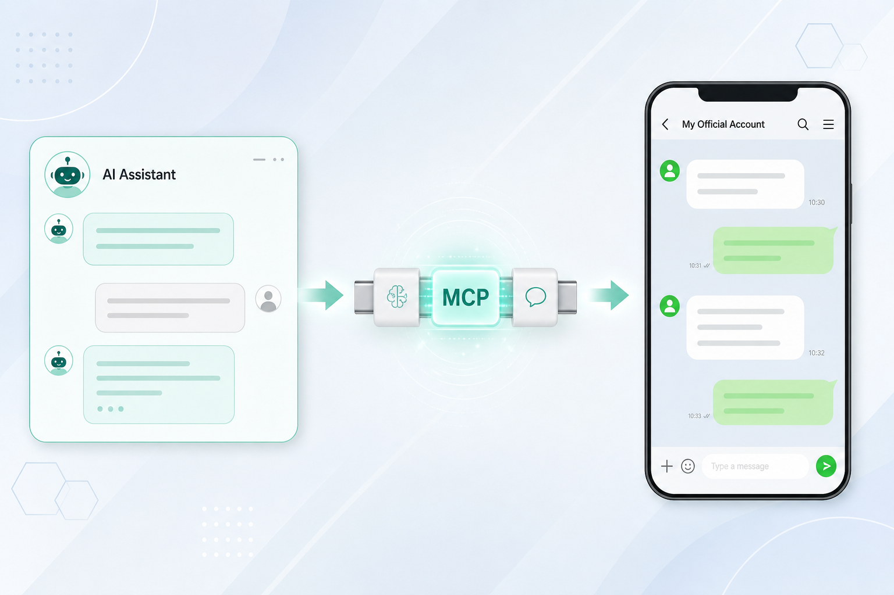
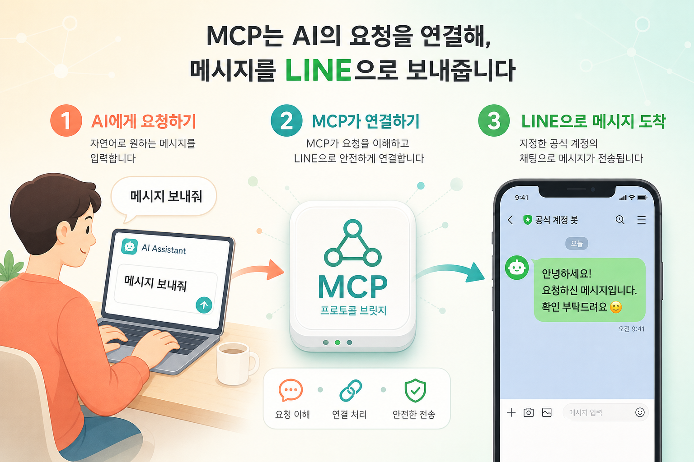

# MCP 팝업 그래픽 제안 (2안)

관련 Figma: [LPC_New-features — node 11487-17](https://www.figma.com/design/5SZXRS3Nd81tyXz0vSxsSF/LPC_New-features?node-id=11487-17)

> 참고: 이 환경에서 Figma MCP 인증이 불가해 원본 팝업 레이아웃은 직접 확인하지 못했습니다.  
> LINE Bot MCP Server의 핵심 메시지(AI ↔ Messaging API 연결)를 기준으로, **비개발자도 한눈에 이해**할 수 있는 그래픽 2안을 제안합니다.

---

## 공통 목표

팝업에서 사용자가 바로 이해해야 할 한 문장:

> **AI에게 말하면, MCP를 통해 LINE으로 메시지가 전달됩니다.**

---

## 제안 A — 연결 메타포 (추천: 브랜드·기능 인지)

**파일:** `mcp-popup-concept-a-connector.png`

| 항목 | 내용 |
|------|------|
| 컨셉 | AI 채팅 ↔ **MCP 커넥터** ↔ LINE 채팅 |
| 이해 포인트 | MCP = AI와 LINE을 잇는 “만능 연결 플러그” |
| 적합한 카피 | 제목: `AI와 LINE을 MCP로 연결하세요` / 본문: `AI 에이전트가 Messaging API로 메시지를 보낼 수 있습니다` |
| 장점 | 한 장으로 구조 설명, 기술 용어를 시각적으로 풀어줌 |
| 주의 | 로고·브랜드 가이드에 맞게 AI/LINE 표현을 공식 에셋으로 교체 |

---

## 제안 B — 3단계 사용 흐름 (추천: 행동 유도)

**파일:** `mcp-popup-concept-b-3steps.png`

| 항목 | 내용 |
|------|------|
| 컨셉 | ① AI에게 요청 → ② MCP가 연결 → ③ LINE에 메시지 도착 |
| 이해 포인트 | “내가 뭘 하면 되는지” 순서대로 보임 |
| 적합한 카피 | 제목: `3단계로 시작하는 MCP` / CTA: `가이드 보기` / `지금 연결하기` |
| 장점 | 온보딩·신규 기능 안내 팝업에 강함, 학습 비용 낮음 |
| 주의 | 단계 문구는 실제 LPC 온보딩 플로우에 맞게 조정 |

---

## 선택 가이드

| 상황 | 추천 |
|------|------|
| MCP가 무엇인지 먼저 각인시키고 싶을 때 | **A** |
| 설정/연결 CTA로 바로 유도하고 싶을 때 | **B** |
| A+B 조합 | 첫 팝업은 A(개념), 상세/가이드는 B(절차) |

---

## 다음 액션 (디자인)

1. Figma 팝업 슬롯 비율에 맞춰 크롭·여백 조정
2. LPC 컬러/타이포 토큰에 맞춰 색·폰트 정렬
3. 실제 카피(한/영)와 CTA 문구 확정 후 삽입
4. 공식 LINE / 제품 아이콘으로 플레이스홀더 교체
